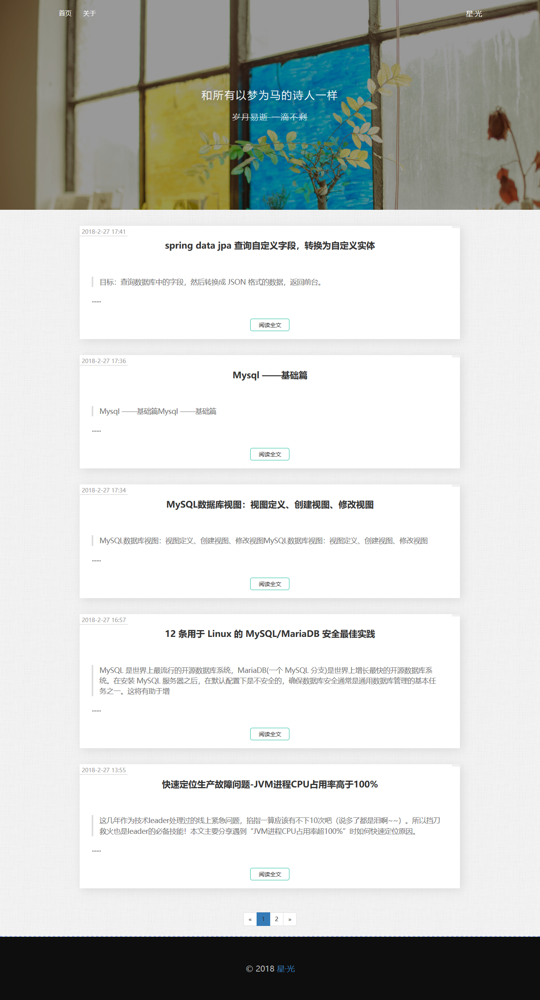
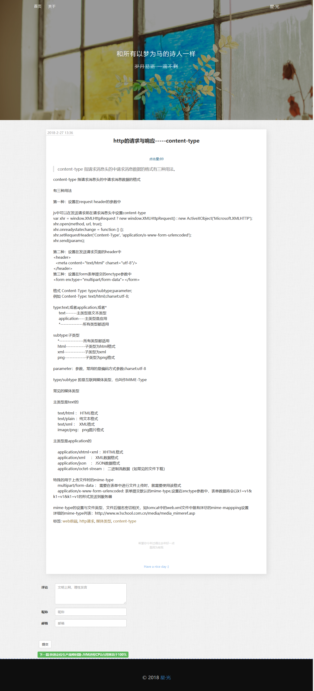
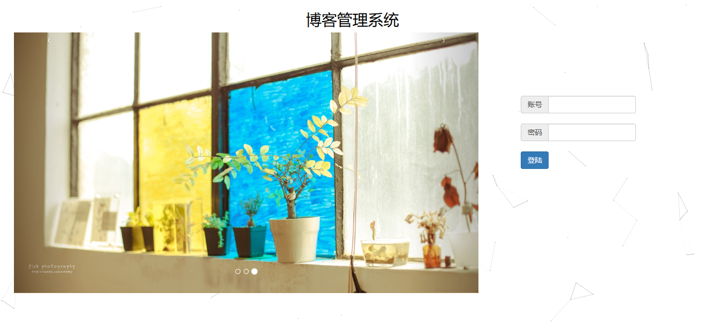
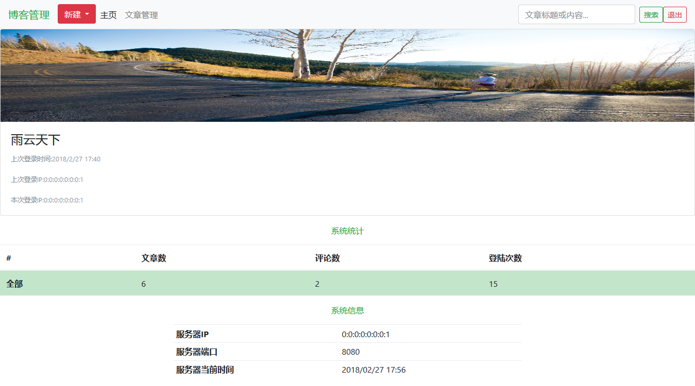
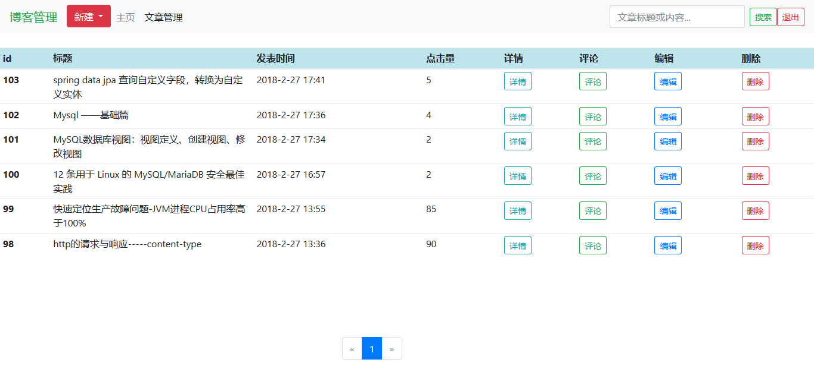
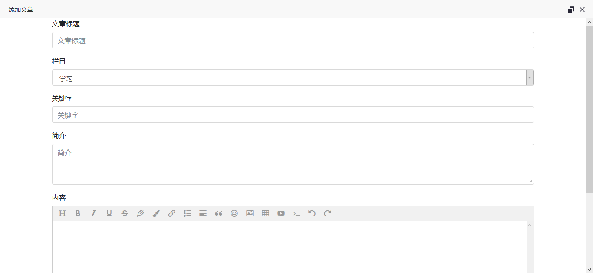

**完整代码收费 +   316595344     或    lz316595344  咨询** 

**接毕业设计和论文**

**如果图片加载不出来可以去博客看 https://blog.csdn.net/qq_56450993/article/details/133607544**

**毕业设计所有选题地址**

**[github]👉https://github.com/XinChennn/allProjects**

**[忻辰的个人博客]👉https://www.ixinjiu.cn/articles/156**

# 个人博客系统

## 一、环境介绍

基于Spring+Spring MVC+Mybatis(Maven方式构建)

## 二、如何使用
```
修改数据库配置文件，运行jetty插件

$ mvn jetty:run

http://localhost:8080
http://localhost:8080/admin 
```
## 三、系统截图














**完整代码 +   316595344     或    lz316595344  咨询** 

**接毕业设计和论文**